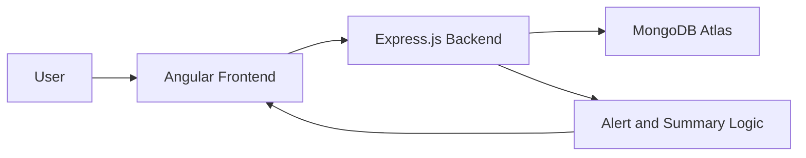

# AI-Based Budget Utilization Monitoring System

## Project Report

### Project Information
- Project Name: AI-Based Budget Utilization Monitoring System
- Frontend Link: https://budget-monitoring-system.vercel.app
- Backend Link: https://budget-monitoring-system.onrender.com
- GitHub Repository: https://github.com/Suyashnimse/budget-monitoring-system
- Development Platform: Angular, Node.js, Express.js, MongoDB Atlas

---

## 1. Title Page
AI-Based Budget Utilization Monitoring System

Submitted as a final year project / academic submission

Prepared by: Student Team

Department: Computer Science / Information Technology

Institution: [Institution Name]

---

## 2. Abstract
The AI-Based Budget Utilization Monitoring System is a web-based application designed to improve financial oversight in organizations by tracking budget allocation, monitoring expenditure, and identifying unusual spending patterns. The proposed system brings budget planning, expense entry, alert generation, and reporting into a single centralized dashboard. It provides departments, finance officers, and administrators with a clear view of how funds are being utilized over time.

The system is implemented using Angular for the frontend, Node.js and Express.js for the backend, and MongoDB Atlas for data storage. It supports user authentication, department management, budget allocation entry, expense tracking, alert generation, audit logging, and dashboard-based monitoring. By combining real-time reporting with automated alerts, the solution enhances transparency, accountability, and decision-making in financial operations.

---

## 3. Introduction
Effective budget management is essential for every organization, whether it is a government department, educational institution, healthcare unit, or private enterprise. Poor tracking of funds often results in overspending, under-utilization, delayed reporting, and weak financial control. Traditional approaches, such as manual spreadsheets or disconnected systems, are inefficient and difficult to maintain.

This project addresses those challenges by developing a web-based budget monitoring platform that centralizes financial information. The application allows authorized users to create budgets, record expenses, monitor utilization percentages, and receive alerts for irregular financial activity. The dashboard provides a summary of expenditure status, helping administrators and finance teams identify problems early and respond proactively.

---

## 4. Problem Statement
Organizations frequently face the following issues in budget management:

- Budget allocation and expenditures are often recorded manually.
- Financial data is stored across multiple locations and formats.
- Budget utilization is difficult to monitor in real time.
- Overspending and sudden expense spikes may remain undetected for long periods.
- Lack of transparency reduces accountability and slows decision-making.

The proposed system solves these problems by creating a unified platform for budget monitoring, expense tracking, and alert management.

---

## 5. Existing Systems / Related Work
Existing budget monitoring approaches mainly rely on spreadsheet-based tools, manual financial reports, or enterprise resource planning systems that are expensive and difficult for smaller organizations to adopt. These systems often have the following limitations:

- Limited automation in data entry and validation
- Weak real-time reporting capabilities
- Minimal support for alert generation
- Lack of role-based user access
- Poor visualization of spending trends

The proposed system improves on these traditional methods by offering a lightweight, web-based, and scalable solution that is easier to deploy and maintain while still supporting essential financial monitoring features.

---

## 6. Proposed Solution
The proposed solution is a full-stack budget monitoring system that enables organizations to manage budget utilization more efficiently. The platform includes:

- User authentication and role-based access
- Department management
- Budget creation and allocation tracking
- Expense entry and categorization
- Dashboard-based financial summaries
- Alert generation for overspending and unusual activity
- Audit logs for accountability
- Report viewing and download support

The system is designed to be practical and user-friendly, allowing finance officers and administrators to monitor spending without needing complex manual processes.

---

## 7. System Architecture
The system follows a three-tier architecture consisting of a frontend client, a backend API, and a database.

### Architecture Overview
- Frontend: Angular-based web interface hosted on Vercel
- Backend: Node.js and Express.js REST API hosted on Render
- Database: MongoDB Atlas for storing departments, budgets, expenses, users, and audit information
- Communication: JSON-based API requests between the frontend and backend

---

## 8. Implementation Details
### 8.1 Frontend Implementation
The frontend is built with Angular and includes several functional modules:

- Login page for user access
- Dashboard for summary metrics such as total budget, total expenses, remaining budget, and active alerts
- Budget page for adding and reviewing budget allocations
- Expense page for recording expenses against specific budgets
- Department and user management views
- Alerts page for viewing generated financial warnings
- Reports page for financial reporting views

The user interface is designed to make financial data easy to read, with clear forms and organized pages for each module.

### 8.2 Backend Implementation
The backend is implemented using Node.js and Express.js. It exposes RESTful APIs for core operations such as:

- User registration and login
- Department creation and retrieval
- Budget addition and listing
- Expense creation and listing
- Alert summary generation
- Audit log storage and retrieval

The backend uses Mongoose models for structured data management and JWT for secure authentication.

### 8.3 Database Design
The MongoDB database stores the following major entities:

- Users
- Departments
- Budgets
- Expenses
- Audit Logs

Each record is designed to support easy retrieval and future analytics.

### 8.4 Alert Logic
The alert module evaluates financial data to identify conditions such as:

- Expenses exceeding the allocated budget
- Low utilization percentage
- Sudden spikes in recent expenses

These alerts help users understand abnormal financial activity and respond quickly.

### 8.5 Deployment
The project is deployed as follows:

- Frontend: Vercel
- Backend: Render
- Database: MongoDB Atlas

This deployment strategy makes the application accessible online and suitable for real-world demonstration.

### 8.6 API Endpoints and HTTP Methods
The backend exposes the following main API routes using standard HTTP methods:

| Module | Endpoint | HTTP Method | Purpose |
|--------|----------|-------------|---------|
| Authentication | /register | POST | Register a new user |
| Authentication | /login | POST | Authenticate a user |
| Budget | /api/budget | GET | Retrieve budgets |
| Budget | /api/budget | POST | Create a new budget |
| Expense | /api/expense | GET | Retrieve expenses |
| Expense | /api/expense | POST | Record a new expense |
| Department | /api/department | GET | Retrieve departments |
| Department | /api/department | POST | Create a department |
| Alerts | /api/alerts | GET | Retrieve alert summary |
| Audit Logs | /api/auditlogs | GET | Retrieve audit logs |

Example request formats:

- GET /api/budget
- POST /api/expense
- POST /register
- POST /login

These requests use JSON payloads for creating records and return JSON responses for client-side rendering.

---

## 9. Results and Analysis
The developed system successfully demonstrates how budget tracking and expenditure monitoring can be automated through a web application. The main outcomes include:

- Centralized monitoring of budgets and expenses
- Improved visibility into utilization status
- Alert generation for unusual financial behavior
- Better traceability through audit logs
- A simple and practical interface for finance-related tasks

The dashboard provides a quick summary of financial conditions, while the alerts page shows critical warning states. The implementation proves that the application is capable of supporting administrative oversight and improving budget accountability.

---

## 10. Conclusion
The AI-Based Budget Utilization Monitoring System provides an effective solution to the challenges of manual budget tracking and delayed financial oversight. By combining web-based monitoring, automated alerts, and centralized financial data, the project improves transparency and supports better decision-making.

The system is a practical foundation for future expansion into more advanced financial analytics, forecasting, and intelligent decision support.

---

## 11. Future Work
The current system can be extended in several directions:

- Integration of machine learning for budget forecasting
- Predictive anomaly detection using historical data
- Mobile application support
- Integration with ERP and treasury systems
- OCR-based invoice and receipt processing
- Advanced reporting and visualization modules

These upgrades would further strengthen the system’s role as a modern AI-assisted financial monitoring platform.

---

## 12. References
- Angular Documentation: https://angular.dev/
- Node.js Documentation: https://nodejs.org/
- Express.js Documentation: https://expressjs.com/
- MongoDB Documentation: https://www.mongodb.com/docs/
- JSON Web Token Documentation: https://jwt.io/
- Vercel Documentation: https://vercel.com/docs
- Render Documentation: https://render.com/docs
